# FGV CH224A_Board

 [https://felixardyansyah.github.io/CH224A_MODULE_FGV/](https://felixardyansyah.github.io/CH224A_MODULE_FGV/)

### 🔌 CH224A_Board module compatible with Arduino library

This board is built around the CH224A, a compact and efficient power negotiation controller from WCH. The chip communicates with modern USB-C Power Delivery (PD) and Quick Charge (QC) sources, allowing your project to request a wide range of voltages beyond the standard 5 V — up to 28 V depending on the adapter’s capabilities. Control is flexible: voltages can be set using simple GPIO pin selection for lightweight applications or managed dynamically through the I²C interface for advanced use cases such as protocol detection and current monitoring.

The module is designed to be breadboard-friendly, making it easy to integrate into rapid prototypes or test circuits. A dedicated R2 footprint is provided for users who want to install a 1 kΩ resistor to simulate a USB-C e-marker. This allows the board to negotiate higher power profiles and draw up to 5 A of input current, without requiring a cable with a built-in e-marker chip. This feature expands the module’s usefulness in high-power embedded projects.

By offloading the complexity of PD/QC negotiation to the CH224A, this board makes it possible to safely draw higher voltages and currents from standard USB-C and QC power adapters without bulky external circuitry. It is well suited for powering ESP32/STM32 systems, battery chargers, or any compact device that requires more than 5 V input.

# *⚠️ !!! reminder CH224A is 5V sensitive it can kill your IC so becareful where you put your wire into !!! ⚠️*

## **Features**

### *🔍 Detect supported protocols(PD, QC 2/3, AVS, EPR, BC 1.2)*

### *📈 Read maximum supported current output in milliamps(PD mode only)*

### *⚡ Control USB PD/QC output voltage(5V to 28V)*

## 📐 Module dimention

- **Board Size**: 23 mm × 15.24 mm  

## libraries instalation

### Manual

1. Go to **FGV_CH224X** repo.

2. Click the green Code button → **Download ZIP**.

3. Open Arduino IDE.

4. Go to Sketch → **Include Library** → **Add .ZIP Library…**

5. Select the **ZIP** you just downloaded.

### Arduino IDE Library Manager(available now)

1. Open the Arduino IDE.  

2. Go to **Tools → Manage Libraries…**  

3. Search for **FGV_CH224X**.  

4. Click **Install**.

Library link and If you want to buy the board(I’m working with local seller **Freelab Jakarta**, soo its only available in Indonesia):
### [GITHUB LIBRARY CH224A LINK](https://github.com/felixardyansyah/FGV_CH224X)
### [BUY MODULE BOARD CH224A LINK(FREELAB)](https://www.tokopedia.com/freelab-jakarta)
### [BUY MODULE BOARD CH224A LINK(ME DIRECLY)](https://shopee.co.id/PD-QC-decoy-trigger-USB-type-C-I2C-CH224A-module-By-FVG-i.308559525.41969254944?sp_atk=50d630ca-4368-4fdb-bb9a-6ab43b57e671&xptdk=50d630ca-4368-4fdb-bb9a-6ab43b57e671)
## Arduino I2C Library Commands
&#8211;&nbsp;&nbsp; `isPowerGood() read data type bool`
 the power good indicator from CH224A/Q active low mean voltage good = 0, voltage bad = 1
 &#8211;&nbsp;&nbsp; `setVoltage() write data type int`
 0:5V, 1:9V, 2:12V, 3:15V, 4:20V, 5:28V, 6:PPS mode(CH224Q), 7:AVS mode(CH224Q)
 **setVoltage(4)**//  trigger the usb to output 20V (only available in USB PD protocol)
 &#8211;&nbsp;&nbsp; `getCurrentProfile() read data type int`
 it output in int for example charger/powerbank that output 65W it will say 3250 
 &#8211;&nbsp;&nbsp; `hasProtocol() write data type bool`
 **CH224X1.hasProtocol(CH224X_I2C::PROTOCOL_BC)** mean it using USB BC protocol
 **CH224X1.hasProtocol(CH224X_I2C::PROTOCOL_QC2)** mean it using USB QC2 protocol
 **CH224X1.hasProtocol(CH224X_I2C::PROTOCOL_QC3)** mean it using USB QC3 protocol
 **CH224X1.hasProtocol(CH224X_I2C::PROTOCOL_PD)** mean it using USB BC protocol
 **CH224X1.hasProtocol(CH224X_I2C::PROTOCOL_EPR)** mean it using USB EPR protocol
 **CH224X1.hasProtocol(CH224X_I2C::PROTOCOL_EPR_EXIST)** mean the charger support EPR/Extended Power Range protocol
 **CH224X1.hasProtocol(CH224X_I2C::PROTOCOL_AVS_EXIST)** mean the charger support AVS/Adjustable Voltage Supply protocol

        
for using CH224A/Q with power good
`CH224X_I2C CH224X1(Wire, 0x23, PG_PIN)` or
`CH224X_I2C CH224X1(2, 3, 0x23, PG_PIN)` depending of your pinout

for using CH224A/Q without power good
`CH224X_I2C CH224X1(Wire, 0x23)` or
`CH224X_I2C CH224X1(2, 3, 0x23)` depending of your pinout

and make sure in the setup you insert `CH224X1.begin();`

## I2C Wiring with static pinout Example

### ⚠️ NOTE using 5V logic MCU must use 5L and 5D pin for to use built in I2C TTL voltage converter

### Arduino / ATmega / LGT8F328 (5V logic)

| CH224X Pin     | Board Pin Example |
|----------------|-------------------|
| SDA (5D)       | A5 (Arduino, LGT8F328) → *may differ on other MCUs* |
| SCL (5L)       | A4 (Arduino, LGT8F328) → *may differ on other MCUs* |
| PG (Power Good)| A7 |
| 5V             | 5V |
| 3V             | 3.3V |
| GND            | GND |

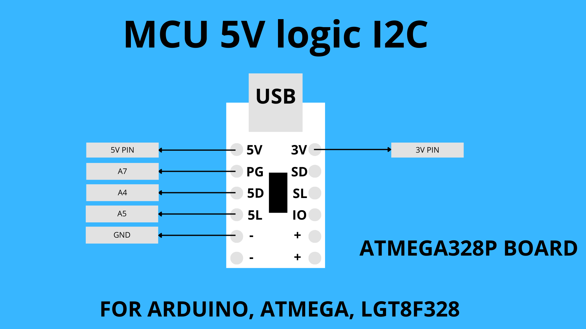

### STM32 (3.3V logic)

| CH224X Pin     | Board Pin Example |
|----------------|-------------------|
| SDA (SD)       | PB7 (STM32F103xxx) → *may differ on other MCUs* |
| SCL (SL)       | PB6 (STM32F103xxx) → *may differ on other MCUs* |
| PG (Power Good)| PB5 |
| 3V             | 3.3V |
| GND            | GND |

### ESP32xxx (3.3V logic)

| CH224X Pin     | Board Pin Example |
|----------------|-------------------|
| SDA (SD)       | GPIO 5 (ESP32-S3) → *you can choose other safe pins* |
| SCL (SL)       | GPIO 6 (ESP32-S3) → *you can choose other safe pins* |
| PG (Power Good)| GPIO 7 (ESP32-S3) → *you can choose other safe pins* |
| 3V             | 3.3V |
| GND            | GND |

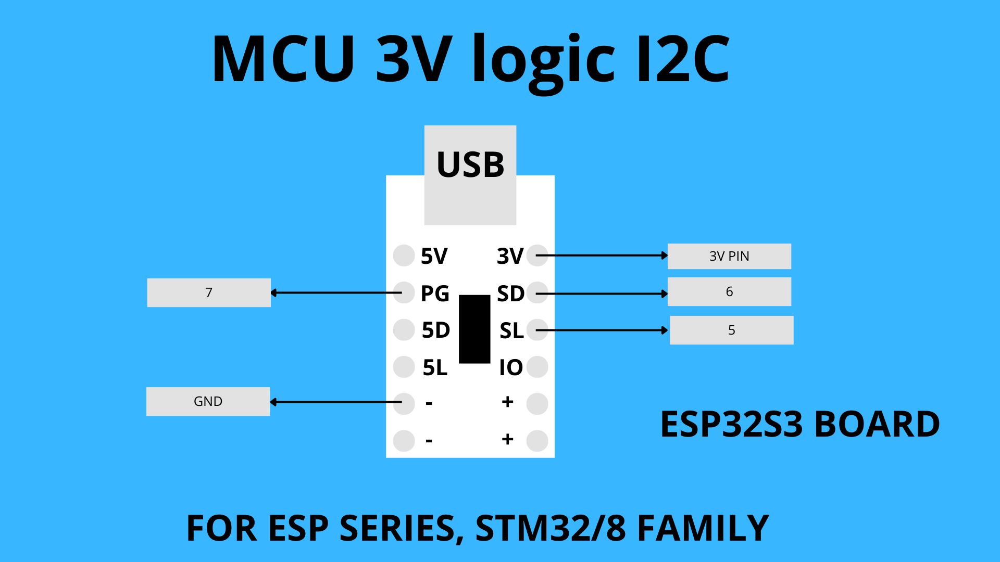

###  ⚠️ NOTE

In **I2C** mode, The default address is `0x22` or `0x23`, for USB PD you can grab current data becouse USB PD talk via in both direction via CC line, while with USB QC2/3 protocol you cannot grab maximum charger/powerbank current can handle reason the reason QC talk via Resistor not via a logic like USB PD.

## Arduino IO Library Commands
&#8211;&nbsp;&nbsp; `isPowerGood()`
 the power good indicator from CH224A/Q active low mean voltage good = 0, voltage bad = 1
 &#8211;&nbsp;&nbsp; `setVoltage()` 
 for CH224_AQ 0:5V, 1:9V, 2:12V, 3:20V, 4:28V
 for CH224_K  0:5V, 1:9V, 2:12V, 3:15V, 4:20V

for using CH224A/Q with power good
 `CH224X_IO CH224X1(IO1, IO2, IO3, CH224_AQ, PG_PIN);`

for using CH224A/Q without power good
 `CH224X_IO CH224X1(IO1, IO2, IO3, CH224_AQ);`

for using CH224K with power good
 `CH224X_IO CH224X1(IO1, IO2, IO3, CH224_K, PG_PIN);`

for using CH224K without power good
 `CH224X_IO CH224X1(IO1, IO2, IO3, CH224_K);`

and make sure in the setup you insert `CH224X1.begin();`

## IO Wiring with static pinout Example

# ⚠️ Reminder if you use 5V logic MCU you need 2K resistor if not your CH224X will release the magic smoke

### Arduino / ATmega / LGT8F328 (5V logic, with resistors)

| CH224X Pin     | Need       | Board Pin Example |
|----------------|-------------------|-------------------|
| SDA (IO1)      | 2 kΩ resistor     | A6 (Arduino, LGT8F328) → *may differ on other MCUs* |
| IO2 (SD)       | 2 kΩ resistor     | A5 (Arduino, LGT8F328) → *may differ on other MCUs* |
| IO3 (SL)       | 2 kΩ resistor     | A4 (Arduino, LGT8F328) → *may differ on other MCUs* |
| 3V             | —                 | 3.3V |
| GND            | —                 | GND |

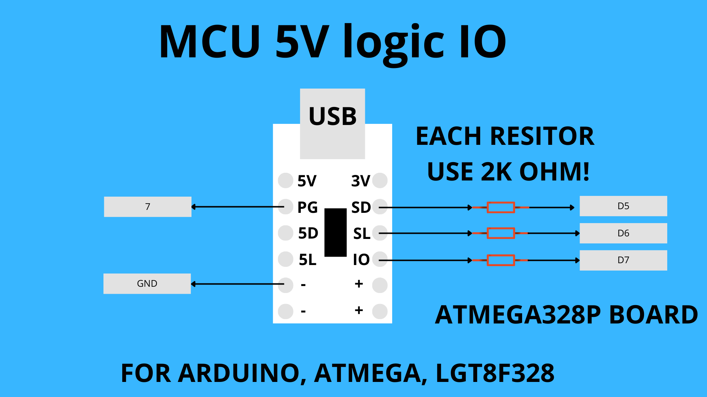

### ESP32 / STM32 (3.3V logic)

| CH224X Pin     | Board Pin Example |
|----------------|-------------------|
| SDA (IO1)      | GPIO 4 (ESP32-S3) → *you can choose other safe pins* |
| IO2 (SD)       | GPIO 6 (ESP32-S3) → *you can choose other safe pins* |
| IO3 (SL)       | GPIO 5 (ESP32-S3) → *you can choose other safe pins* |
| 3V             | 3.3V |
| GND            | GND |

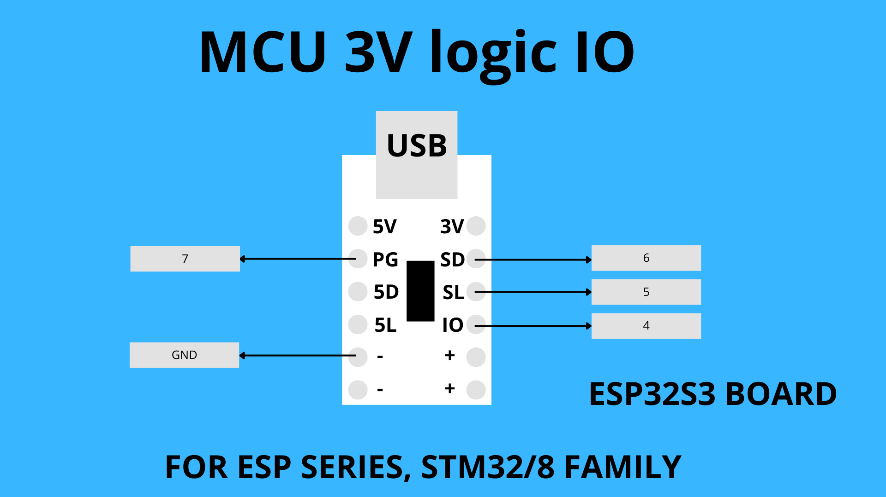

In **IO** mode, you cannot do that much again it is the limitation of simple GPIO logic of CH224X but in the bright side is kinda simple and use less memory. with 3V logic MCU like STM32 or ESP32 you dont need any additional component, but if you use 5V logic MCU you need additional resistor

Also included in the repository are:
 &nbsp;&nbsp;&#9679;&nbsp; An Arduino sketch that use all the function with specific wiring of your board the the module board or IC themself
 &nbsp;&nbsp;&#9679;&nbsp; Recent copies of CH224X Datasheet in english and chinese in the Documents folder.

## ENABLING E MARKER SIMULATION

The board has an **R2 footprint** for simulating a USB-C e-marker. To enable this, solder a **1 kΩ 0603 resistor** at R2. This allows the module to negotiate up to **5 A input current** from a compatible USB-C PD source — without needing a cable with a built-in e-marker. ⚠️ Make sure your **adapter support 5 A** before use.

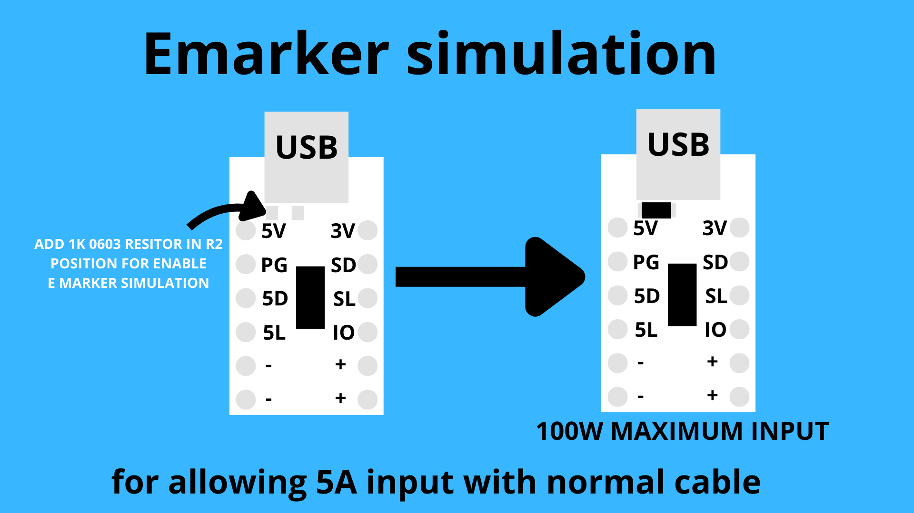

##  PICTURE

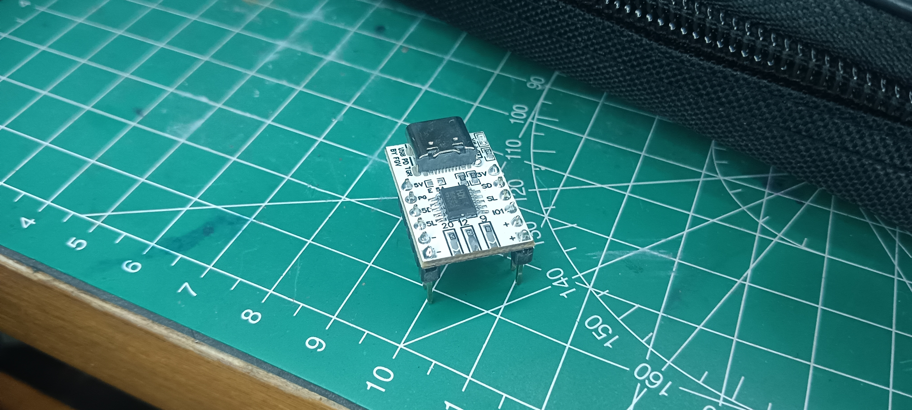

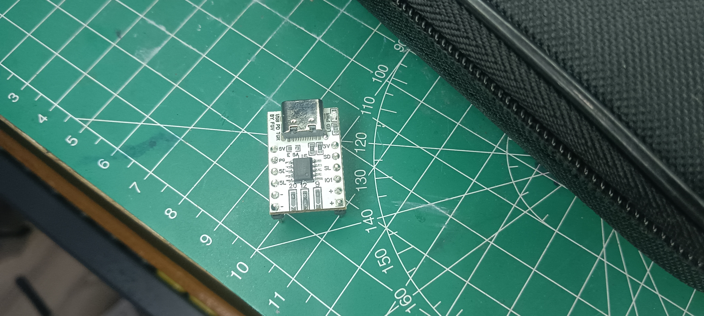

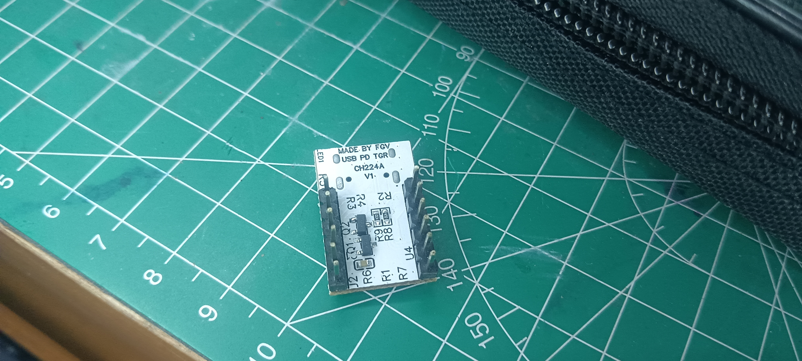

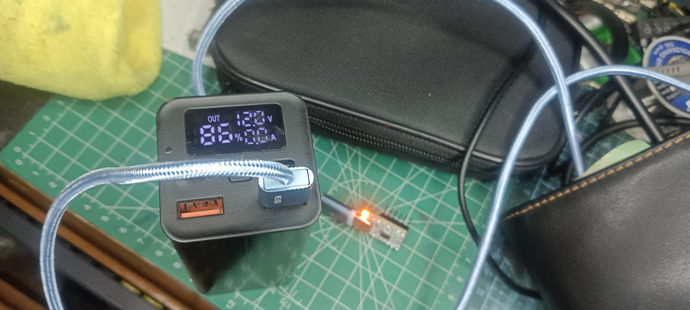

##  ASSEMBLY PICTURE

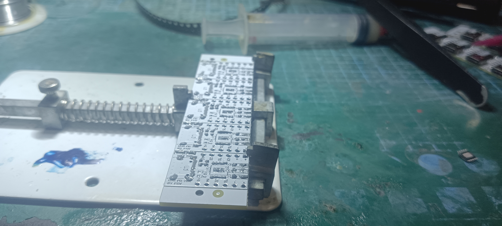

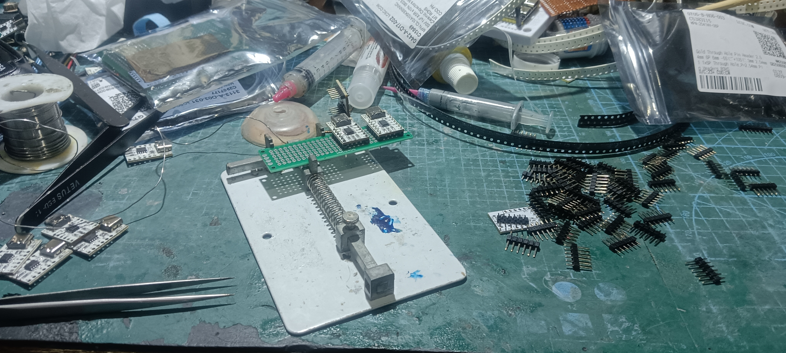

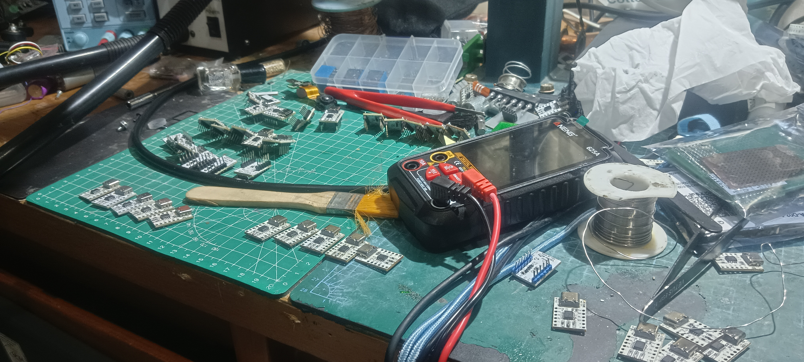

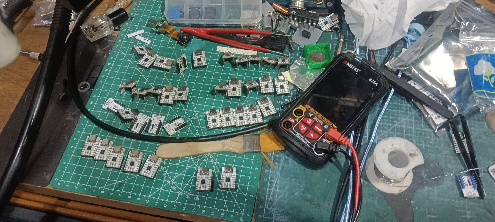

## Folder structure

# CH224A MODULE Folder Structure

- CH224A_MODULE_FGV/
  - `documents/`
    - [CH224X_English.pdf](documents/CH224X_English.pdf) — WCH datasheet (English)
    - [CH224X_Chinese.pdf](documents/CH224X_Chinese.pdf) — WCH datasheet (Chinese)
  - `Schematic/`
    - [CH224A_MODULE.pdf](schematic/CH224A_MODULE.pdf) — Full schematic
    - [CH224A_MODULE.png](schematic/CH224A_MODULE.png) — Schematic preview
  - `Gerber/`
    - Gerber_CH224A_MODULE — Gerber File
  - `img/` — Board photos, renders, pinouts
  - README.md
  - LICENSE.md

## License

### 📂 Library Code (`/src`)
The **Arduino library code** is licensed under the **MIT License**.  

**Copyright (c) 2025 Felix Ardyansyah**

---

### 🖼️ Documentation, Schematics, and PCB Layouts
The **documentation, schematics, PCB layouts, and design files** for the **CH224A module** are licensed under the **Creative Commons Attribution-ShareAlike 4.0 International License (CC-BY-SA 4.0).**

#### You are free to:
- **Share** — copy and redistribute the material in any medium or format  
- **Adapt** — remix, transform, and build upon the material for any purpose, even commercially  

#### Under the following terms:
- **Attribution** — You must give appropriate credit, provide a link to this license, and indicate if changes were made  
- **ShareAlike** — If you remix, transform, or build upon the material, you must distribute your contributions under the same license as the original  

🔗 Full license text: [CC-BY-SA 4.0](https://creativecommons.org/licenses/by-sa/4.0/)
